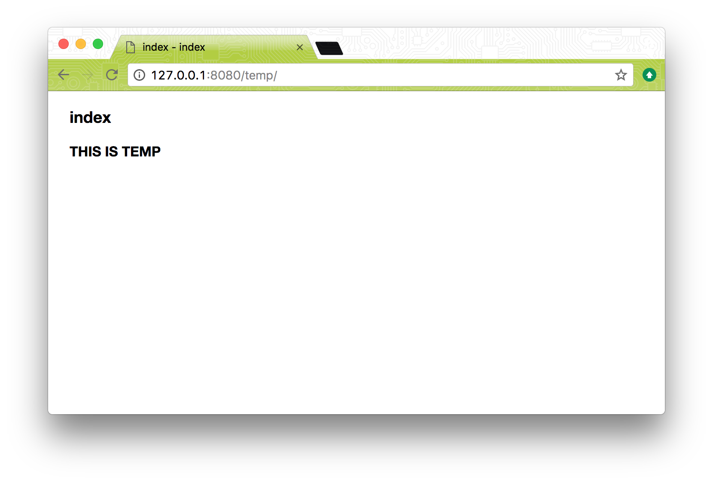

# generate-temp

This generates the `temp` folder in test one, and tries to open that generated `temp/index.html` in test two.

To get started, first run `npm install`. To run the tests which will generate `temp`, do `npm test`.

The generated `temp/index.html` looks like this when served using `http-server`:

Where **THIS IS TEMP** is added to the DOM post-load by a JavaScript file `temp.js` that is loaded by StealJS.

## Issues

### Zombie issue

Related to issue: https://github.com/stealjs/steal/issues/1177
Status: **SOLVED**

After running `npm test`, note that the second test in `test.js` cannot find `window.PACKAGES` because steal is not working under zombie.

However, if you do `http-server` and visit <http://127.0.0.1:8080/temp/>, you will see everything works fine under a normal browser.

You might want to `it.only` the second test once you have `temp` generated (perhaps with `devBuild`) if you plan on editing anything in `temp` so changes don't get overriden.

For instance, in relation to the `devBuild` issue (below), you might want to manually fix the location in `temp/index.html` to point to `./static/node_modules/steal/steal.js`.

### devBuild issue

Related to issue: https://github.com/bit-docs/bit-docs-generate-html/issues/26
Status: **UNSOLVED**

Another issue was recently discovered, and it has to do with `bit-docs-generate-html`:

In the first test that generates `temp`, there is an option `devBuild` that is currently set to `false`.

If you change this to `true`, then the generated output in `temp/index.html` should change in the following way:

https://github.com/bit-docs/bit-docs-generate-html/blob/minor/site/default/templates/layout.mustache

However, for some reason it does not, and effectively `{{devBuild}}` is evaluating to false in this mustache template.

So, if you change `devBuild` to true and run `npm test`, the steal dependencies will **not** be compressed into `./static/steal.production.js` (as expected), but the `index.html` will still be pointing there (not expected), and will not find anything (404 on trying to load steal).

## About the dependencies

See `package.json` that the latest npm versions of all dependencies are being used, including a pre-release of `bit-docs-generate-html`.

This `0.5.0-pre.4` pre-release updates `bit-docs-generate-html` to use steal `1.X` and updates the location it references `steal.production.js` in the above mentioned `site/default/templates/layout.mustache` because the newer version of steal puts it in a different location when bundling, comapared to the old location of `./static/node_modules/steal/steal.production.js`.

